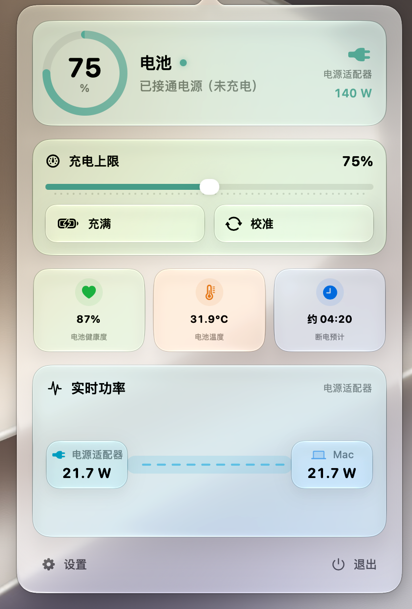
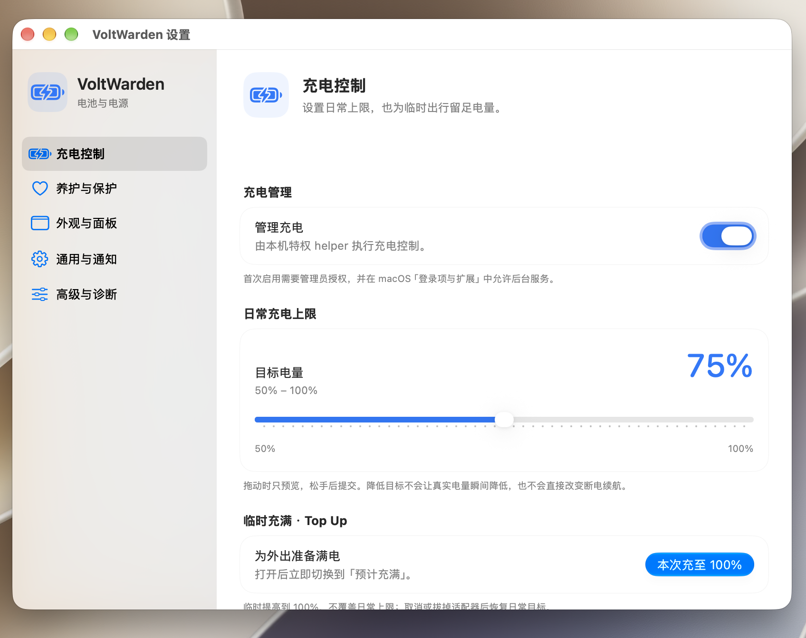

# VoltWarden

**让 MacBook 按我设定的电量停充，而不是一直充到满。**

我平时经常把 MacBook 插着电用，也想一眼看清现在到底是在充电、保持，还是由电池供电。系统自带的充电上限只给 80%–100%，我想用的却是 75% 这类更灵活的目标，于是做了 VoltWarden：一个放在菜单栏里的电池工具，设置好后就让它安静待着。

除了充电上限，我还做了电量、健康度、温度、适配器功率、充满时间和断电续航的展示。续航数字是估计值，不会跟着每一次瞬时功率波动来回跳。

## 实际界面

下面是我自己 Mac 上运行时的截图，不是设计稿。左边是菜单栏面板，右边是充电设置。

<table>
  <tr>
    <td align="center" width="36%">
       
      菜单栏面板 · 电量、适配器和功率流向
    </td>
    <td align="center" width="64%">
       
      充电设置 · 日常上限与临时充满
    </td>
  </tr>
</table>

## 先说适用范围

**我目前在自己的 Apple 芯片 MacBook、macOS 27 上使用和验证。** 当前提供的是 Apple 芯片版，不是 Intel 版。

- **macOS 26.4 及以上：**苹果系统自带 80%–100% 充电上限；VoltWarden 的 50%–79% 用到了额外的控制路径。我还没有在 26.4–26.x 上验证 75% 是否能稳定停住。
- **macOS 26.3 及更早：**是否能真正停充更依赖具体机型的硬件能力。我不把“能打开软件”等同于“限充一定生效”。
- **Intel Mac：**目前的 App 和后台助手都是 Apple 芯片版本，不能直接运行。
- **macOS 14.7 及更早：**低于当前 App 声明的最低系统版本，不支持安装。

如果你只需要 80%–100%，并且 Mac 已经运行 macOS 26.4 或更新版本，也可以先试试 [macOS 自带的充电上限](https://support.apple.com/en-au/102338)。

## 快速上手：第一次安装

> **目前仓库已上传源码，安装包还没有放进 Releases。** 等 [Releases](https://github.com/Tsing-Z-QZ/VoltWarden/releases) 里出现 `VoltWarden-v1.0-arm64.zip` 后，再照下面做。页面自动给的「Source code (zip)」是源码，双击不能当 App 用。

### 步骤零：确认你的 Mac

点屏幕左上角 ** → 关于本机**。看到「芯片」是 M 系列，再看 macOS 版本；如果写的是 Intel，先不要下载这个安装包。

### 步骤一：下载并放进「应用程序」

1. 打开 [Releases](https://github.com/Tsing-Z-QZ/VoltWarden/releases)，点进最新版本，展开 **Assets**。
2. 下载名字形如 **`VoltWarden-v1.0-arm64.zip`** 的文件。不要下载页面自动生成的 **Source code**。
3. 在访达打开「下载」文件夹，双击 ZIP 解压，得到 **VoltWarden.app**。
4. 把 **VoltWarden.app** 拖到访达侧边栏的「应用程序」。如果以前装过，先从菜单栏退出旧版，再替换；不要直接在 ZIP 或下载文件夹里运行。

### 步骤二：第一次打开

1. 到「应用程序」里双击 **VoltWarden**。它是菜单栏软件，打开后去屏幕右上角找电池小图标；**Dock 里没有常驻图标是正常的**。
2. 如果 macOS 弹出“无法验证开发者”之类的提示，先确认文件确实来自本仓库的 Release。然后打开 **系统设置 → 隐私与安全性**，向下找到 **“仍要打开”**，再按系统提示确认。[苹果也有图文说明](https://support.apple.com/en-gb/102445)。
3. 如果系统说文件**已损坏**或**会损害电脑**，不要强行绕过；先到 [Issues](https://github.com/Tsing-Z-QZ/VoltWarden/issues) 告诉我具体提示。

### 步骤三：设定你想要的上限

1. 点击菜单栏的电池图标 → **设置**，打开 **管理充电**。
2. 如果 macOS 让你允许后台运行，去 **系统设置 → 通用 → 登录项与扩展 → 允许在后台运行**，找到 VoltWarden 或充电助手，把它打开；需要管理员密码时，只在 macOS 自己的窗口里输入。
3. 回到软件，必要时退出并重新打开。拖动滑块到想要的上限，**松开滑块后**才会提交。
4. 第一次使用时，留意实际电量和系统充电状态。界面显示的目标值是你设定的目标，不代表硬件已经成功执行；如果电量仍持续冲过目标，先拔下充电线，再检查后台助手是否获准运行。

## 我平时会用到的功能

- **日常限充：**设一个平时想保持的电量，不用每次手动改系统设置。
- **临时充满：**出门前需要满电时点「充满」，结束后回到日常目标。
- **状态看得懂：**电量、健康度、温度、适配器规格和功率流向都放在菜单栏面板里。
- **时间只做参考：**断电还能用多久、充到目标还需多久都是估计，不参与充电控制。把目标从 75% 改成 50%，电池的真实电量也不会瞬间少 25%。

有问题就在 [Issues](https://github.com/Tsing-Z-QZ/VoltWarden/issues) 留下 Mac 型号、macOS 版本、目标电量和实际电量。发日志前记得遮住序列号等隐私信息。

## 想看看代码

我把源码、测试和打包方法都放在仓库里，详细步骤见 [发布指南](docs/RELEASING.zh-CN.md)。项目采用 [GPL-3.0](LICENSE)，已有代码与依赖的来源见 [开源与版权说明](ATTRIBUTION.md)。图标的平面源文件也在 `Packaging/IconSource/`。
